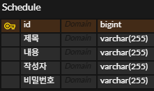

# 📅 Schedule API (일정 관리 서비스)

> 단순 CRUD를 넘어, 
> **비즈니스 로직(비밀번호 검증)과 계층 분리 설계**를 적용한 일정 관리 API입니다.

---

## 🧑‍💻 프로젝트 소개

이 프로젝트는 일정(Schedule)을 생성, 조회, 수정, 삭제할 수 있는 REST API입니다.

특히 다음과 같은 점에 집중하여 설계했습니다.

* 3 Layer Architecture 기반 설계
* 비밀번호 검증을 통한 데이터 보호
* 조건 조회 API 설계 (Query Parameter 활용)
* DTO를 활용한 민감 정보 보호

---

## 🏗️ 아키텍처

```id="gk5d02"
Controller → Service → Repository → DB
```

### 📌 계층별 역할

| Layer      | 역할                  |
| ---------- | ------------------- |
| Controller | HTTP 요청/응답 처리       |
| Service    | 비즈니스 로직 (비밀번호 검증 등) |
| Repository | DB 접근               |
| Entity     | 테이블 매핑              |
| DTO        | 데이터 전달 (비밀번호 숨김)    |

👉 각 계층을 분리하여 **책임을 명확하게 나누고 유지보수성을 높였습니다.**

---

## ⚙️ 기술 스택

* **Backend**: Java 17, Spring Boot
* **ORM**: Spring Data JPA
* **Database**: MySQL
* **Library**: Lombok

---

## 📌 주요 기능

### ✅ 일정 생성

```java
POST /schedules
```

* 제목, 내용, 작성자명, 비밀번호로 일정 생성
* 생성일 / 수정일 자동 저장

---

### ✅ 전체 일정 조회

```java
GET /schedules
GET /schedules?userName=홍길동
```

✔ 특징

* 작성자명으로 필터링 가능
* 하나의 API로 조건 조회 처리
* **수정일 기준 내림차순 정렬**
* 비밀번호 제외 응답

  👉 Repository에서 정렬 처리

  👉 Service에서 조건 분기 처리


---

### ✅ 단건 조회

```java
GET /schedules/{id}
```

* ID 기반 조회
* 비밀번호는 응답에서 제외

---

### ✅ 일정 수정

```java
PATCH /schedules/{id}
```

✔ 조건

* 비밀번호 일치 시에만 수정 가능
* 수정 가능 필드: `title`, `userName`

  👉 Service에서 검증 로직 수행

---

### ✅ 일정 삭제

```java
DELETE /schedules/{id}?password=1234
```

✔ 특징

* `@RequestParam`으로 password 전달
* 비밀번호 일치 시에만 삭제
  
  👉 REST 설계에 맞게 Body 대신 Query Param 사용

---

## 🔐 비밀번호 검증 흐름

```
1. 일정 조회
2. DB 비밀번호 vs 요청 비밀번호 비교
3. 불일치 → 예외 발생
4. 일치 → 수정/삭제 수행
```

  👉 비즈니스 로직은 Service에서 처리  
  👉 Controller는 HTTP 응답만 담당


---

## 📊 POSTMAN: schedule-app API 명세서
https://documenter.getpostman.com/view/53036105/2sBXitDTZU

---

## ⚙️ ️ERD


---
